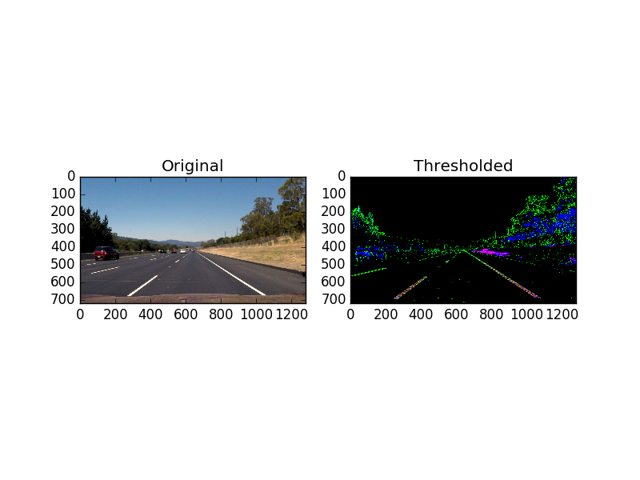
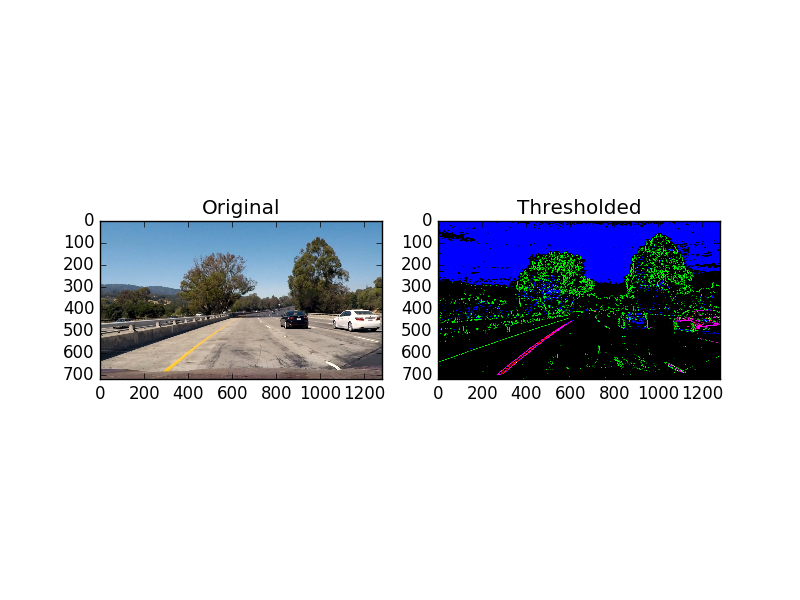
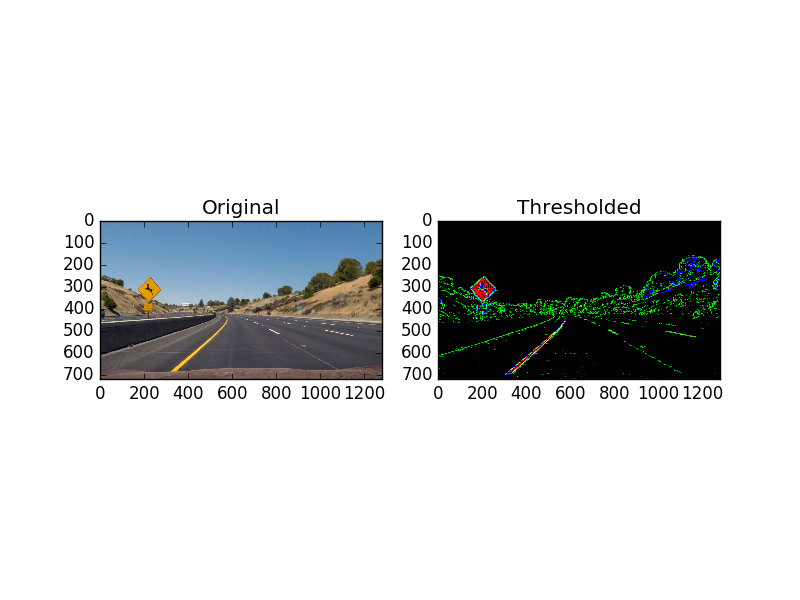
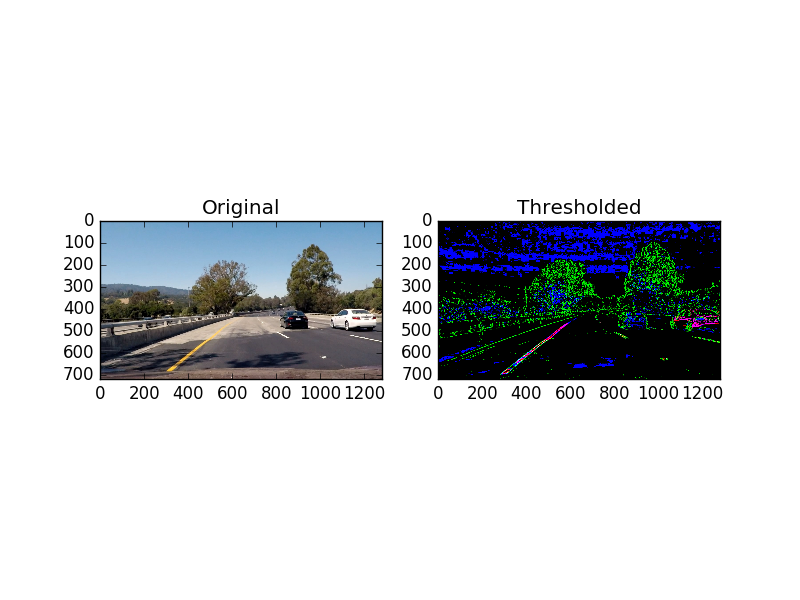

# Project 4 - Advanced Lane Finding #

## Camera Calibration ##
Camera calibration is a straightforward application of lessons in this course.  There was one additional method that I applied to properly calibrate the camera with the provided calibration images.  Namely, I found that not all of the images had the same number of corners, i.e. some of the chessboards were cropped.  So, I implemented a search function, as a set of nested `if` statements, in order to find the correct number of corners for each images.  A sample of that code, from [calibrate_camera.py](calibrate_camera.py), is shown below.

```python
# 9x6 corners
        ret, corners = cv2.findChessboardCorners(gray, (9,6), None)
        if ret is True:
            objp = np.zeros((9*6,3), np.float32)
            objp[:,:2] = np.mgrid[0:9,0:6].T.reshape(-1,2)
            imgpoints.append(corners)
            objpoints.append(objp)
            if suppress is False:
                print('9x6 corners found in image '+str(fidx))
        else:
            
            # 9x5 corners
            ret, corners = cv2.findChessboardCorners(gray, (9,5), None)
            if ret is True:
```

Even with this search, I was unable to get calibration points out of file 4.  By visual inspection, it's not clear why one of these combinations is not sufficient.

There are two pairs of images demonstrating the camera calibration below.


It is very clear in the chessboard image, above, that the slightly curved lines have been straightened.  It's not as apparent on the image of the road, but if one examines the left and right edges closely, the undistorted images shows less of the periphery, and the road sign on the right-hand side is a more natural shape.  There are additional images in this repository, saved as output_images/undistorted\*.png showing the rest of the undistort results.

## Thresholding ##
For thresholding I combined three techniques: Sobel gradient threshold in the horizontal (x) direction, HLS threshold in the S-plane, and RGB thresholds around yellow and white colors.  Each of the three results is represented by a different color in the composite images below.









