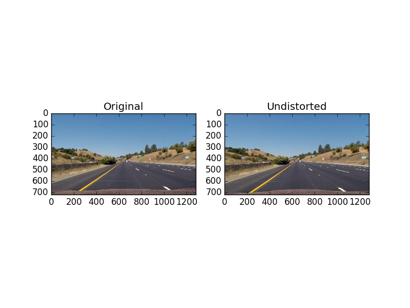

# Project 4 - Advanced Lane Finding #

## Files ##

All python source code is in [advanced_lane_finding.py](advanced_lane_finding.py).

All output images reference herein or otherwise are in [/output_images](output_images).

The source video and result are [project_video.mp4](project_video.mp4) and [project_video_out.mp4](project_video_out.mp4), respectively.

## Camera Calibration ##
Camera calibration is a straightforward application of lessons in this course.  There was one additional method that I applied to properly calibrate the camera with the provided calibration images.  Namely, I found that not all of the images had the same number of corners, i.e. some of the chessboards were cropped.  So, I implemented a search function, as a set of nested `if` statements, in order to find the correct number of corners for each images.  A sample of that code is shown below.

```python
# 9x6 corners
        ret, corners = cv2.findChessboardCorners(gray, (9,6), None)
        if ret is True:
            objp = np.zeros((9*6,3), np.float32)
            objp[:,:2] = np.mgrid[0:9,0:6].T.reshape(-1,2)
            imgpoints.append(corners)
            objpoints.append(objp)
            if suppress is False:
                print('9x6 corners found in image '+str(fidx))
        else:
            
            # 9x5 corners
            ret, corners = cv2.findChessboardCorners(gray, (9,5), None)
            if ret is True:
```

Even with this search, I was unable to get calibration points out of file 4.  By visual inspection, it's not clear why one of these combinations is not sufficient.

There are two pairs of images demonstrating the camera calibration below.




It is very clear in the chessboard image, above, that the slightly curved lines have been straightened.  It's not as apparent on the image of the road, but if one examines the left and right edges closely, the undistorted images shows less of the periphery, and the road sign on the right-hand side is a more natural shape.  There are additional images in this repository, saved as output_images/undistorted\*.png showing the rest of the undistort results.

## Thresholding ##
For thresholding I combined three techniques: Sobel gradient threshold in the horizontal (x) direction, HLS threshold in the S-plane, and RGB thresholds around yellow and white colors.  Each of the three results is represented by a different color in the composite images below.  Red pixels are returned from the yellow or white RGB thresholding, green pixels are returned from the Sobel gradient thresholding, and blue pixels are from the HLS thresholding.  The relevant code is broken into four functions: one for each threshold, and a combining function:

```python
def threshold(src):
    # Apply both Sobel (X) and HSL (S) thresholds
    # on an image, take union of the two results

    # Sobel value
    sobel_binary = SobelX(src)

    # S value
    s_binary = HlsGrad(src)

    # yellow and white values
    color_binary = ColorFilt(src)
            
    stack= np.dstack((255*color_binary, 255*sobel_binary, 255*s_binary))

    return stack

def SobelX(src):
    # Apply a Sobel gradient to an image
    # keep only the pixels that lie within the thresholds
    
    gray = cv2.cvtColor(src, cv2.COLOR_RGB2GRAY)
    sobelx = cv2.Sobel(gray, cv2.CV_64F, 1, 0)
    abs_sobelx = np.absolute(sobelx)
    scaled_sobel = np.uint8(255*abs_sobelx/np.max(abs_sobelx))
    sobel_binary = np.zeros_like(scaled_sobel)
    sobel_binary[(scaled_sobel > SobelX.thresh[0]) & (scaled_sobel <= SobelX.thresh[1])] = 1

    return sobel_binary

def HlsGrad(src):
    # Apply an HLS color transformation on an image
    # keep only the pixels that lie within the thresholds in the S plane
    
    hls = cv2.cvtColor(src, cv2.COLOR_RGB2HLS)
    s = hls[:,:,2]
    color_binary = np.zeros_like(s)
    color_binary[(s > HlsGrad.s_thresh[0]) & (s <= HlsGrad.s_thresh[1])] = 1

    return color_binary

def ColorFilt(src):
    # Keep only the pixels that lie within the thresholds near yellow and white
    
    color_binary = np.zeros_like(src[:,:,2])
    color_binary[(((src[:,:,0] > ColorFilt.yellow[0][0]) & (src[:,:,0] < ColorFilt.yellow[0][1]))
                 &((src[:,:,1] > ColorFilt.yellow[1][0]) & (src[:,:,1] < ColorFilt.yellow[1][1]))
                 &((src[:,:,2] > ColorFilt.yellow[2][0]) & (src[:,:,2] < ColorFilt.yellow[2][1])))
                 |(((src[:,:,0] > ColorFilt.white[0][0]) & (src[:,:,0] < ColorFilt.white[0][1]))
                 &((src[:,:,1] > ColorFilt.white[1][0]) & (src[:,:,1] < ColorFilt.white[1][1]))
                 &((src[:,:,2] > ColorFilt.white[2][0]) & (src[:,:,2] < ColorFilt.white[2][1])))] = 1

    return color_binary
```

All of the test images are in the [/output_images](output_images) folder, I show the one below that I find the most interesting.  There are contributions from each of the three filtering methods apparent.


## Perspective Warping ##

For perspective transformation, I assumed that a constant, x-symmetric trapezoid, mapped into a rectangle, would be my mapping.  I used one of the test images that I judged, by eye, to have very straight lines, and iteratively moved the vertices of the trapezoid, until the resulting warped image showed straight lines.  

The vertices that I eventually settled on are shown in function `warp_and_unwarp_params()`.  `poly1` represents the trapezoid, and `poly2` represents the rectangle into which it is mapped.  `poly2` is simply the corners of the image.

```python
def warp_and_unwarp_params():
    # Constant parameters for warp and unwarp

    cols = np.float32(1280)
    rows = np.float32(720)
    horz = np.float32(450) # horizon y-coordinate
    center = np.float32(cols/2) # horizontal center x-coordinate
    tr_width = np.float32(200) # width of the trapezoid upper leg
    s = np.float32(0.3) # slope of the trapezoid right leg (dy/dx)
    
    p1 = [center-tr_width/2, horz] # upper left vertex
    p4 = [center+tr_width/2, horz] # upper right vertex
    p2 = [p1[0]-(rows-horz)/s, rows] # lower left vertex
    p3 = [p4[0]+(rows-horz)/s, rows] # lower right vertex

    # warp polygon
    poly1 = np.float32([p1,p2,p3,p4])

    # result polygon (image border)
    poly2 = np.float32([[0,0],[0,rows],[cols,rows],[cols,0]])

    return poly1, poly2
```

The image I used to select my polygon is shown below.


## Fitting and Measurements##

For fitting, I used method very similar to that in the lessons.  First I created a histogram of the binary image column-wise, for the bottom half of the image:
```python
# Sum up along the vertical direction, find a starting point to search
hist = np.sum(src[mid_height:,:], axis=0)
```
For the initial search, I let the left and right lanes start anywhere in the left-half and righ-half of the image, respectively.  For subsequent images, I only allowed the search to take place within a neighborhood of the last frame.  This prevented the lane lines from jumping toward barriers that show up even after filtering is completed.  I used attribute `center` of `class Line` to do this:
```python
if LaneLines.center == []:
    left_center = np.argmax(hist[:slice_width]) # horizontal center of the left search rectangle
    right_center = slice_width+np.argmax(hist[slice_width:]) # horizontal center of the right search rectangle
else:
    window_left = LaneLines.center[0]-np.uint32(find_lines.width/2)
    window_right = LaneLines.center[0]+np.uint32(find_lines.width/2)
    left_center = window_left+np.argmax(hist[window_left:window_right])
    window_left = LaneLines.center[1]-np.uint32(find_lines.width/2)
    window_right = LaneLines.center[1]+np.uint32(find_lines.width/2)
    right_center = window_left+np.argmax(hist[window_left:window_right])
LaneLines.center = [np.uint32(left_center), np.uint32(right_center)]
```
I divided the image up into eight horizontal bands, and allowed the search window to move from band-to-band.  For the initial fit, I used the same `np.polyfit` approach as in the lessons.  To remove noise (jitter), in the next fits, I used a standard low-pass filter on the resulting points.  I used attributes `bestx` and `best_fit` and method `draw_lines` for this.  For the low-pass filter I used a 20% contribution from the current fit, and an 80% contribution from previous fits.  This cleaned up the final trouble spot, near the end of the video, when the road changes colors briefly.
```python
def draw_lines(self, rows):
    # draw lines using polyfit and EWMA on previous fits
    ploty = np.linspace(0, rows-1, num=rows)
    if self.bestx == []:
        self.bestx = np.zeros((2,rows), dtype = np.float32)
        self.bestx[0] = self.best_fit[0,0]*ploty**2 + self.best_fit[0,1]*ploty + self.best_fit[0,2]
        self.bestx[1] = self.best_fit[1,0]*ploty**2 + self.best_fit[1,1]*ploty + self.best_fit[1,2]
    else:
        tmp = np.zeros((2,rows), dtype = np.float32)
        tmp[0] = self.best_fit[0,0]*ploty**2 + self.best_fit[0,1]*ploty + self.best_fit[0,2]
        tmp[1] = self.best_fit[1,0]*ploty**2 + self.best_fit[1,1]*ploty + self.best_fit[1,2]
        self.bestx[0] = 0.2*tmp[0] + 0.8*self.bestx[0]
        self.bestx[1] = 0.2*tmp[1] + 0.8*self.bestx[1]
```

The image below demonstrates where the barrier is showing up in the warped image, but the lane lines are correctly identified.


In order to measure the car's position within the lane, I calculated the distance from the center of the image to the left line, and the distance from the center of the image to the right line.  The difference between these two, converted from pixels to meters, gives the relative position within the lane.  A value of 0 means the car is centered.  During the video, the car seems to be slightly in the left half of the lane for most of the time, although it sometimes will cross over to the right side.  The method `position` does this calculation:

```python
def position(self, cols):
    # negative values indicate bias to right line
    # positive values indicate bias to left line
    pos_pixel = (self.center[1]-cols/2)-(cols/2-self.center[0])
    pos_meter = pos_pixel * 3.7 / self.width_pixels()
    return pos_meter
```

For calculating the radius of each line, I used the code provided in the lesson, substituting my own variables.  During the video, when the road is actually curving, the radii seems to be in 100m to 1000m range, so based on the guidance, this is reasonable.  When the lanes are straight, the calculated radii can get quite large.  This is to be expected, as the radius is undefined for a straight line.  Ideally, there should be a resulting value above which the radius is ignored.  The attribute `radii` is where this information is stored.  Additionally, it uses the low-pass filtered result for x and y points, so the radii themselves are also low-pass filtered.

```python
self.radii = np.zeros((2,), dtype = np.float32)

    ym_per_pix = 30/720
    xm_per_pix = 3.7/700
    y_eval = np.max(ploty)
    left_fit_cr = np.polyfit(ploty*ym_per_pix, self.bestx[0]*xm_per_pix, 2)
    right_fit_cr = np.polyfit(ploty*ym_per_pix, self.bestx[1]*xm_per_pix, 2)
    # Calculate the new radii of curvature
    self.radii[0] = ((1 + (2*left_fit_cr[0]*y_eval*ym_per_pix + left_fit_cr[1])**2)**1.5) / np.absolute(2*left_fit_cr[0])
    self.radii[1] = ((1 + (2*right_fit_cr[0]*y_eval*ym_per_pix + right_fit_cr[1])**2)**1.5) / np.absolute(2*right_fit_cr[0])
```

The image below shows and example of both the calculated lane position and the radius of the lane lines (0.98m left of center, 838m for the left line, 586m for the right line.


## Result Video ##

[)](https://youtu.be/DlZwk43E1X4)
